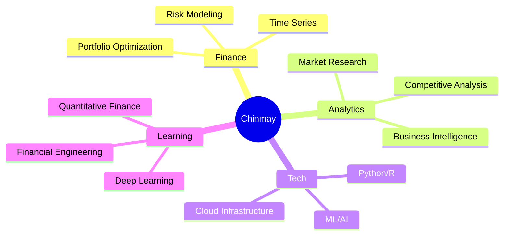

<div align="center">
  
  
  
  <p align="center">
    <a href="mailto:chinmaydongarkar@gmail.com"></a>
    <a href="https://linkedin.com/in/chinmay-do"></a>
    <a href="https://github.com/yourusername"></a>
  </p>
  
  
  
</div>

## 🚀 About Me

```python
class Chinmay:
    def __init__(self):
        self.role = "Business Analyst | Data Scientist"
        self.location = "Copenhagen, Denmark 🇩🇰"
        self.education = "MSc Business Analytics @ DTU"
        self.currently_working_on = [
            "Market Intelligence Automation @ Bactolife A/S",
            "Time-Series Forecasting Models",
            "Open Finance Tools"
        ]
        self.interests = [
            "Quantitative Finance",
            "Risk Modeling", 
            "Machine Learning",
            "Business Strategy"
        ]
    
    def say_hi(self):
        print("Let's build something data-driven together!")

me = Chinmay()
me.say_hi()
```


## 🛠️ Tech Stack

<div align="center">

### 💻 Languages & Core Tools
<p>
  
  
  
  
</p>

### 📊 Data Science & ML
<p>
  
  
  
  
  
</p>

### ☁️ Cloud & Infrastructure
<p>
  
  
  
  
</p>

</div>


<h2>📌 Featured Projects</h2>

<table width="100%">
  <tr>
    <!-- LEFT COLUMN -->
    <td width="50%" valign="top" align="center">

<h3>📊 Portfolio Risk Engine</h3>


<p align="left">
<b>Monte Carlo Financial Risk Modeling</b><br><br>
🎲 VaR & Expected Shortfall analysis<br>
🐍 Python with NumPy & Pandas<br>
📈 10,000+ scenario simulations<br>
✅ Comprehensive backtesting
</p>

    </td>

    <!-- RIGHT COLUMN -->
    <td width="50%" valign="top" align="center">

<h3>📈 Equity Forecaster</h3>


<p align="left">
<b>Time-Series Prediction System</b><br><br>
🧠 ARIMA & LSTM models<br>
📊 Returns & volatility forecasting<br>
🎯 15% accuracy improvement<br>
🔄 Full backtesting framework
</p>

    </td>
  </tr>
</table>


### 🌍 Macro-Sector Model


**Econometric Analysis Platform**
- 📉 Macro indicators → Sectoral profit
- 📊 R-based analytics
- 🔄 Automated data pipelines
- 🎯 8+ sectors covered

</td>
<td width="50%" valign="top">

### 🤖 Competitor Intelligence Bot


**AI Market Monitoring System**
- 🔍 Automated data collection
- 🤖 GPT-powered analysis
- ⚡ 60% time reduction
- 🔄 N8N workflow automation


</td>
</tr>
</table>

</div>


## 🎯 Current Focus




## 🤝 Let's Collaborate

### 📫 Reach out!

**📧 Email:** chinmaydongarkar@gmail.com  
**💼 LinkedIn:** [linkedin.com/in/chinmay-do](https://linkedin.com/in/chinmay-do)  
**📍 Location:** Copenhagen, Denmark

</div>


<div align="center">
  
### 💭 Quote of the Day
  


---


**⭐ From [Chinmay](https://github.com/Chinmay921)**

</div>
